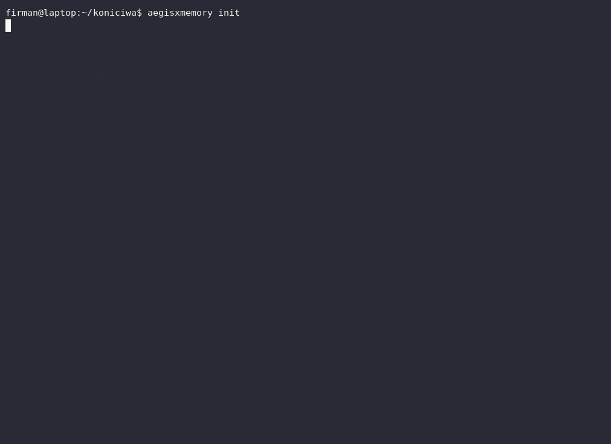
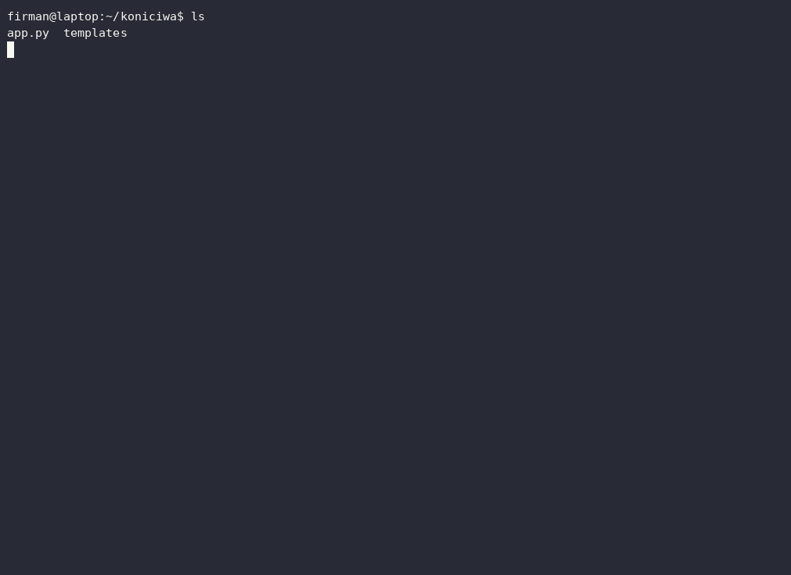

# AegisX-Memory

**Mesin memori persisten untuk AI coding agent — berhenti membaca ulang codebase Anda.**

[](https://github.com/aegisxresearch/AegisX-Memory/actions/workflows/ci.yml)


**English** | **Bahasa Indonesia** (dokumen ini) — versi Inggris adalah acuan bila ada perbedaan.

Setiap sesi baru AI agent menjelajahi ulang repo Anda: arsitektur, keputusan, jebakan, perintah test — dipelajari dari nol, setiap saat. AegisX-Memory memperbaiki ini dengan **lapisan memori lokal tanpa cloud** yang menyuntikkan *hanya konteks yang relevan* di awal sesi, di bawah batas token yang ketat.

- 🧠 **Mengingat** — fakta, keputusan, jebakan (gotcha), handoff sesi, struktur kode
- ⚡ **Cepat** — ~1rb file terindeks dalam <10 detik; re-scan <200 ms
- 🔒 **Privat** — semuanya tersimpan di `~/.aegisx` di mesin Anda; tanpa koneksi jaringan ke mana pun
- 🤖 **Ramah-agent** — 5 tool MCP yang bekerja dengan Hermes, Claude, Cursor, atau klien MCP mana pun
- 📊 **Terpantau** — dashboard web lokal dengan knowledge graph interaktif

## ⚡ TL;DR — install, jalankan `setup`, jawab 2 pertanyaan. Selesai.

**Langkah 1 — install:**

```bash
curl -fsSL https://raw.githubusercontent.com/aegisxresearch/AegisX-Memory/main/install.sh | sh
```

**Langkah 2 — wizard terpandu** (dia nanya agent Anda apa dan mau otomatis apa tidak — itu saja):

```bash
aegisxmemory setup
```

**Langkah 3 — restart agent Anda.** Selesai. Tidak ada lagi yang perlu dijalankan — selamanya.

Lihat langsung jalannya wizard (rekaman nyata, tanpa skrip):



Mulai sekarang loop memorinya otomatis (flag `--rules` membuat agent recall di awal sesi dan save di akhir sesi dengan sendirinya). Anda tinggal kerja dan ngobrol normal:

> *"build a login feature"* → agent bekerja → memori ter-update sendiri → sesi berikutnya dia ingat semuanya.

**Apa yang sekarang Anda punya — dan cara mengecek tiap bagiannya.** Tidak ada lagi yang perlu dijalankan sendiri:

| Bagian | Apa itu | Cara mengecek |
|---|---|---|
| **Server MCP (stdio)** | lima tool memori yang dipanggil agent Anda. **Agent yang menjalankannya — Anda tidak pernah menjalankannya,** dan "mengaktifkan" berarti me-restart agent | `aegisxmemory doctor` → menyebut apakah registrasinya terpasang; [§5.4](#54-verifikasi-registrasi) mengecek server-nya langsung |
| **Aturan memori otomatis** | perintah tetap untuk recall di awal sesi dan save di akhir (dipasang `--rules`) | blok marker di `~/.hermes/SOUL.md` (atau file aturan agent Anda) — [§6](#6-membuat-memori-otomatis) |
| **Dashboard web** | tampilan browser atas yang dia ingat, plus satu write terjaga (hapus satu entri knowledge) | `aegisxmemory dashboard` → buka tautan `http://127.0.0.1:3360` yang dicetak |
| **Server MCP HTTP** | *hanya* untuk agent yang tidak bisa men-spawn subprocess (sebagian ekstensi IDE, container, mesin remote) — **tidak perlu** untuk Hermes/Claude/Cursor | `aegisxmemory serve` → [§5.5](#55-transport-http-agent-remote--ide) |

**Semua yang di bawah garis ini adalah bacaan opsional** — cara kerjanya, apa yang terpasang, dan bahan rujukan.

---

---

## 📖 Daftar Isi

1. [Mengapa ini ada?](#1-mengapa-ini-ada)
2. [Bagaimana cara kerjanya](#2-bagaimana-cara-kerjanya)
3. [Instalasi](#3-instalasi)
4. [Quick start lima menit](#4-quick-start-lima-menit)
5. [Menghubungkan AI agent Anda](#5-menghubungkan-ai-agent-anda)
6. [Membuat memori otomatis](#6-membuat-memori-otomatis)
7. [Loop harian](#7-loop-harian)
8. [Dashboard web](#8-dashboard-web)
9. [Referensi CLI](#9-referensi-cli)
10. [Fakta: penamaan, batasan, contoh](#10-fakta-penamaan-batasan-contoh)
11. [Session handoff: kontrak JSON](#11-session-handoff-kontrak-json)
12. [Observability & live index](#12-observability--live-index)
13. [Diagnostik: doctor](#13-diagnostik-doctor)
14. [Environment variables](#14-environment-variables)
15. [Keamanan & privasi](#15-keamanan--privasi)
16. [Troubleshooting](#16-troubleshooting)
17. [Uninstall](#17-uninstall)
18. [Pengembangan](#18-pengembangan)
19. [Arsitektur](#19-arsitektur)
20. [Roadmap](#20-roadmap)
21. [Lisensi](#21-lisensi)

---

## 1. Mengapa ini ada?

Kalau Anda memakai AI coding agent (Hermes, Claude Code, Cursor, …), Anda tahu ritualnya: setiap sesi dimulai dengan agent membaca ulang file, menemukan ulang bahwa test dijalankan dengan `npm test`, tersandung jebakan yang sama, dan menanyakan ulang keputusan yang kemarin sudah diambil.

Itu memakan **waktu** (menit per sesi), **token** (sekali baca ulang codebase bisa ~8.000+ token), dan **ketepatan** (agent lupa keputusan kemarin dan mengulangi kesalahan kemarin).

AegisX-Memory adalah solusinya: lapisan memori yang bisa agent *recall* dalam satu panggilan, *diisi* selama bekerja, dan *diterimai* handoff di akhir sesi. Anggap saja buku catatan yang dikelola agent per project — tapi buku catatan ini tidak pernah basi, karena isinya dikunci ke hash isi file, bukan timestamp.

## 2. Bagaimana cara kerjanya

Tiga store di bawah satu database SQLite (`~/.aegisx/memory.sqlite`, WAL + FTS5):

| Store | Yang diingat | Manfaatnya |
|---|---|---|
| **FactStore** | fakta stabil: stack, perintah test, konvensi (`project.<repo>.<key>`) | tidak pernah bertanya ulang "testnya dijalankan pakai apa?" |
| **KnowledgeGraph** | simbol, peta modul, penanda TODO/FIXME, keputusan & gotcha | menggantikan pembacaan ulang codebase yang generik |
| **SessionStore** | handoff terkompresi: tujuan, fakta terverifikasi, keputusan, langkah lanjut | sesi baru *melanjutkan*, bukan memulai ulang |

**Invalidasi berbasis hash, bukan timestamp.** Pengetahuan kode dikunci ke hash SHA-256 isi file. Begitu file berubah, memorinya yang basi langsung hilang. Nol jawaban basi, nol heuristik.

**Recall beranggaran.** Satu recall merangkai, dalam batas token yang ketat (default 2.000): fakta repo ini → keputusan, gotcha, dan konvensi repo ini → simbol → handoff terakhir → ringkasan struktur. Beri query dan lapisan knowledge serta simbol berubah dari ter-anchor menjadi berperingkat FTS; tanpa query, tidak ada memori repo lain yang bisa ikut tertarik. Catatan yang sudah dicetak ulang handoff terakhir disajikan sekali, dari handoff itu — bukan dua kali. Kalau kelebihan, item prioritas terendah yang dibuang lebih dulu — tidak pernah di tengah fakta.

## 3. Instalasi

**Persyaratan:** Linux/macOS (Windows lewat WSL), node ≥ 20, npm, git.

### Opsi A — satu baris (disarankan)

```bash
curl -fsSL https://raw.githubusercontent.com/aegisxresearch/AegisX-Memory/main/install.sh | sh
```

Yang dilakukannya:

1. clone repo ini ke `~/.aegisx-app`
2. pasang dependensi (`npm ci`) dan build bundle TypeScript
3. symlink CLI `aegisxmemory` ke `~/.local/bin` (ditambahkan ke PATH bila belum ada)
4. jalankan `aegisxmemory init` untuk membuat `~/.aegisx`

Menjalankan baris yang sama lagi berarti **update** instalasi yang ada (fetch + reset ke origin/main, lalu build ulang).

### Opsi B — npm langsung dari GitHub

```bash
npm install -g github:aegisxresearch/AegisX-Memory
```

TypeScript dibundel di devDependencies, jadi tidak butuh `tsc` global. Kalau jalur ini gagal di setup Anda, pakai Opsi A.

### Opsi C — clone manual

```bash
git clone https://github.com/aegisxresearch/AegisX-Memory.git
cd AegisX-Memory && npm install && npm run build && npm link
```

### Verifikasi

```bash
aegisxmemory --help        # daftar perintah + usage
aegisxmemory init          # jalan juga kalau tadi terlewat
```

## 4. Quick start lima menit

> Sudah menjalankan 2 perintah TL;DR di atas dan menghubungkan agent Anda? **Bagian ini boleh dilewati** — agent menjalankan semua ini sendiri. Langkah di bawah adalah untuk memakai AegisX dari terminal biasa, tanpa agent.

```bash
# 0. sekali saja: buat memori home (~/.aegisx)
aegisxmemory init

# 1. masuk ke project Anda dan index
cd ~/projects/myapp
aegisxmemory index .          # scan pertama: ~1rb file < 10 detik; re-scan < 200 ms

# 2. pin fakta-fakta yang wajib diketahui sesi berikutnya
aegisxmemory remember project.myapp.test-cmd "npm test"
aegisxmemory remember project.myapp.stack "TypeScript + SQLite"

# 3. cetak blok konteks hangat yang akan dilihat agent
aegisxmemory recall           # ≤ 2.000 token, markdown
aegisxmemory recall "login"   # recall terfokus pada query

# 4. akhiri sesi dengan handoff
echo '{"goal":"perbaiki bug login","facts":["error di src/auth/login.ts:42"],"decisions":["naikkan bcrypt 5.1"],"nextSteps":["deploy ulang staging"]}' | aegisxmemory save --json -

# 5. sesi berikutnya: lanjut hangat
aegisxmemory resume
```

Itulah keseluruhan produknya: `index` sekali → `remember` fakta kapan saja → `save` di akhir sesi → `resume` di sesi berikutnya.

## 5. Menghubungkan AI agent Anda

CLI enak untuk Anda, tapi hasil sebenarnya adalah agent yang memanggil tool sendiri. AegisX-Memory menyertakan **server MCP** (Model Context Protocol — protokol standar kabel untuk tool agent). Setelah terdaftar, agent Anda mendapat lima tool:

| Tool | Kegunaan |
|---|---|
| `aegisxmemory_recall` | konteks hangat beranggaran (fakta, simbol, handoff terakhir) |
| `aegisxmemory_remember` | simpan fakta stabil |
| `aegisxmemory_save` | simpan handoff sesi |
| `aegisxmemory_index` | index repo secara inkremental |
| `aegisxmemory_graph` | peta node/edge ringkas dari memori |

> **Anda tidak pernah menjalankan server MCP secara manual.** Agent yang men-spawn-nya sendiri saat agent dijalankan. "Mengaktifkan" server = me-restart agent setelah registrasi.

### 5.1 Satu perintah (disarankan)

```bash
aegisxmemory setup                                  # wizard terpandu — nanya, lalu mengerjakan semua
aegisxmemory mcp-config --install --agent hermes --rules   # padanan manualnya, sekali jalan
aegisxmemory mcp-config --install --agent hermes    # khusus Hermes
aegisxmemory mcp-config --install                   # Hermes + Claude + Cursor sekaligus
```

Wizard `setup` adalah pintu depan yang ramah: dia bertanya *agent Anda apa* (Hermes / Claude / Cursor / semua) dan *apakah memorinya harus otomatis*, lalu merangkai persis perintah-perintah di bawah. Aman dijalankan ulang kapan saja.

Installer-nya:

- membuat file config agent bila belum ada,
- menggabungkan entri `aegisx-memory` bila sudah ada (entri lain tidak disentuh),
- mem-backup file asli di sebelahnya (`*.aegisx-bak`),
- menolak config yang tidak bisa di-parse (tidak pernah merusak),
- mengonversi default kosong yang tidak berbahaya (`mcp_servers:` / `mcp_servers: []`) menjadi mapping yang benar,
- idempotent — dijalankan dua kali, tidak ada yang dobel.

Lalu **restart agent Anda** (MCP tidak punya hot reload). Selesai.

### 5.2 File mana yang ditulis?

| Agent | File config |
|---|---|
| Hermes | `~/.hermes/config.yaml` |
| Claude | `~/.claude/claude_desktop_config.json` (atau env `CLAUDE_CONFIG`) |
| Cursor | `~/.cursor/mcp.json` |

### 5.3 Tempel sendiri (kalau mau)

```bash
aegisxmemory mcp-config                  # blok Hermes + Claude + Cursor, satu output
aegisxmemory mcp-config --agent claude   # JSON ketat untuk claude_desktop_config.json / .mcp.json
aegisxmemory mcp-config --bin            # pakai `aegisxmemory` dari PATH (setelah npm link)
```

Salin blok yang dicetak ke config agent Anda, restart agent. Panduan Hermes lengkap: [`docs/HERMES.md`](docs/HERMES.md).

### 5.4 Verifikasi registrasi

```bash
aegisxmemory doctor        # memeriksa registrasi MCP, memberi hint perbaikan
```

Atau probe server langsung (harus mencetak lima nama tool):

```bash
printf '%s\n' \
  '{"jsonrpc":"2.0","id":1,"method":"initialize","params":{"protocolVersion":"2024-11-05","capabilities":{},"clientInfo":{"name":"probe","version":"0.0.0"}}}' \
  '{"jsonrpc":"2.0","method":"notifications/initialized"}' \
  '{"jsonrpc":"2.0","id":2,"method":"tools/list"}' \
  | aegisxmemory mcp | grep -o '"name":"aegisxmemory_[a-z_]*"'
```

### 5.5 Transport HTTP (agent remote / IDE)

**Kebanyakan orang boleh melewati bagian ini.** Hermes, Claude, dan Cursor semuanya men-spawn server stdio sendiri (§5.1), jadi tidak ada yang perlu dijalankan. Pakai HTTP hanya ketika agent *tidak bisa* men-spawn subprocess — ekstensi IDE, container, atau agent di mesin lain:

```bash
aegisxmemory serve --token rahasia-anda     # http://127.0.0.1:3359/mcp
```

Lima tool yang sama lewat StreamableHTTP, termasuk `aegisxmemory_graph`.

> ### `/mcp` itu endpoint MCP, bukan halaman web
>
> Buka `http://127.0.0.1:3359/mcp` di browser dan Anda akan mendapat halaman penjelasan bahasa sehari-hari: alamat ini apa, kenapa tidak ada yang rusak, dan dashboard ada di mana. Statusnya tetap `406` dan isinya tetap sekadar keterangan — agent tidak bisa tertipu olehnya.
>
> Client lain tidak tersentuh. `curl` (yang mengirim `Accept: */*`) tetap mendapat penolakan JSON-RPC mentah:
>
> ```json
> {"jsonrpc":"2.0","error":{"code":-32000,"message":"Not Acceptable: Client must accept text/event-stream"},"id":null}
> ```
>
> **Itu tanda server bekerja dengan benar, bukan kegagalan.** Menurut spesifikasi Streamable HTTP, `GET` ke endpoint MCP berarti meminta *aliran event* server→client, jadi client yang tidak bisa menerimanya ditolak dengan `406` — justru supaya tab browser nyasar tidak diam-diam diperlakukan sebagai agent. `POST` JSON-RPC yang menyatakan `Accept` yang benar mendapat `200` seperti biasa. Halaman ramah itu dipicu oleh `Accept: text/html` yang eksplisit, yang tidak pernah dikirim client MCP.
>
> Kalau yang Anda cari adalah sesuatu untuk *dilihat* di browser, itu dashboard: `aegisxmemory dashboard`.

Verifikasi transport HTTP ujung-ke-ujung — ini mencetak lima nama tool:

```bash
curl -s http://127.0.0.1:3359/mcp \
  -H 'Content-Type: application/json' \
  -H 'Accept: application/json, text/event-stream' \
  -d '{"jsonrpc":"2.0","id":1,"method":"tools/list"}' | jq -r '.result.tools[].name'
```

Diamankan sejak default:

- hanya bind `127.0.0.1`; bind non-localhost ditolak kecuali token diatur,
- token bearer dibandingkan dalam waktu konstan (SHA-256 + `timingSafeEqual` — tanpa celah timing),
- `--token` / `AEGISX_TOKEN` kosong diperlakukan sebagai "tanpa token" dan tidak akan pernah bisa melewati guard non-localhost,
- guard Host anti DNS-rebinding,
- isi request dibatasi 1 MB (Content-Length maupun chunked) dan ditolak dengan `413` sebelum mencapai transport MCP,
- satu server MCP per request, jadi aliran event yang dibiarkan terbuka tidak akan pernah memblokir client berikutnya (SDK hanya mengizinkan satu transport per server, dan `close()` tidak pernah membebaskan slotnya),
- error handler tidak akan pernah membuat proses server crash.

## 6. Membuat memori otomatis

Registrasi memberi agent *kemampuan* mengingat. Flag `--rules` memberinya *perintah tetap*:

```bash
aegisxmemory mcp-config --install --agent hermes --rules
```

`--rules` menulis blok perilaku berpembatas penanda ke file instruksi tetap milik agent:

| Agent | File rules |
|---|---|
| Hermes | `~/.hermes/SOUL.md` (sesuai docs resmi prompt-assembly Hermes) |
| Claude | `~/.claude/CLAUDE.md` |
| Cursor | `~/.cursor/rules/aegisx-memory.mdc` |

Blok itu menginstruksikan agent untuk:

1. **recall di awal sesi** — sebelum apa pun, panggil `aegisxmemory_recall` untuk repo saat ini;
2. **langsung remember fakta stabil** — perintah test, stack, port, konvensi;
3. **mencatat keputusan/gotcha/konvensi** — di daftar yang sesuai pada handoff `save`, dan setiap entri tersimpan sebagai knowledge yang bisa dicari, bukan hanya di obrolan;
4. **save handoff di akhir sesi** — supaya sesi berikutnya lanjut hangat;
5. **tidak pernah mencoba menyimpan secret** — engine menolaknya.

Sifat keamanannya: berpembatas penanda (apa pun di luar blok tidak diubah), di-backup (`*.aegisx-bak`), idempotent, dan `SOUL.md` Hermes yang dibuat baru diberi identity seed kecil supaya persona agent tidak pernah terhapus.

Setelah memasang rules, **restart agent**. Mulai saat itu Anda tinggal bekerja — loop memorinya berjalan sendiri.

## 7. Loop harian

Semua perintah yang berbasis repo memakai **direktori kerja saat ini** — `cd` dulu ke foldernya. Memori di-namespace per path: project A dan project B tidak pernah bercampur.

Berikut seluruh loop-nya dalam satu rekaman — index sekali, lalu satu panggilan recall mengembalikan peta kode, fakta yang di-pin, dan handoff terakhir:



### 7.1 Kalau agent sudah terhubung (kondisi normal)

Dengan `--rules` terpasang, ini terjadi **dengan sendirinya** — Anda tidak perlu memintanya. Frasa-frasa di bawah hanyalah yang *bisa* Anda ucapkan kalau mau mengarahkan:

| Anda bilang | Agent memanggil |
|---|---|
| *"recall the project memory"* (atau tanpa diminta — rules membuatnya otomatis) | `aegisxmemory_recall` |
| *"remember that tests run with npm test"* | `aegisxmemory_remember` |
| *"save the session handoff"* (atau tanpa diminta — rules membuatnya otomatis) | `aegisxmemory_save` |
| *"re-index after that refactor"* | `aegisxmemory_index` |

> Server MCP di-spawn dari direktori kerja agent. Saat bekerja lintas project, minta agent mengisi parameter `repo` secara eksplisit.

### 7.2 Terminal saja (tanpa agent)

```bash
cd ~/projects/myapp

aegisxmemory index .                  # sekali, lalu ulangi setelah perubahan besar
aegisxmemory resume                   # awal sesi: konteks hangat
aegisxmemory remember project.myapp.test-cmd "npm test"
aegisxmemory recall "auth"            # recall terfokus
echo '{"goal":"…","facts":[…],"decisions":[…],"nextSteps":[…]}' | aegisxmemory save --json -
aegisxmemory forget project.myapp.halus-lama    # hapus sebuah fakta
```

### 7.3 Lembar contekan

| Kapan | Perintah / frasa |
|---|---|
| Pertama kali di sebuah project | `aegisxmemory index .` |
| Awal setiap sesi | `aegisxmemory resume` / *"recall the project memory"* |
| Menemukan sesuatu yang stabil | `aegisxmemory remember project.<nama>.<key> <value>` |
| Akhir sesi | `aegisxmemory save --json -` / *"save the session handoff"* |
| Ingin tahu nilai lama sebuah fakta | `aegisxmemory history <key>` |
| Ingin tahu apa yang dipelajari agen | `aegisxmemory knowledge` |
| Backup / pindah mesin | `aegisxmemory export > memory.md` |
| Mau serahin ke otomatis | `aegisxmemory watch .` di terminal samping |
| Ada yang terasa aneh | `aegisxmemory doctor` |
| Penasaran pemakaian | `aegisxmemory stats` atau `aegisxmemory dashboard` |

## 8. Dashboard web

```bash
aegisxmemory dashboard            # membuka http://127.0.0.1:3360 di browser Anda
aegisxmemory dashboard --no-open  # cukup cetak URL-nya (misal untuk tmux pane)
aegisxmemory dashboard --port 4021
```

Tampilan hidup dari semua yang diingat engine — menyegarkan tiap 10 detik, dirender lokal. Ada dua tampilan: **Overview** adalah bentuk memorinya, **Memory** adalah teksnya. Satu-satunya write di sini adalah menghapus satu entri knowledge; sisanya tetap read-only.

- **Memory browser** — tampilan yang menjawab "sebenarnya di mana saya *membaca* ini?". Pilih sebuah repository dan setiap decision, gotcha, convention, serta lesson yang tercatat di sana muncul lengkap dengan **body utuhnya**, jenisnya, `#id`-nya (handle yang dipakai `aegisxmemory knowledge --forget <id>`), dan tanggalnya, masing-masing dengan tombol salin. Filter per jenis dan kotak pencarian (judul, body, atau id) mempersempit daftarnya, dan baris di atasnya **mengatakan apa yang tidak ditampilkan** — `menampilkan 200 terbaru dari 1.204 entri yang tersimpan untuk repo ini` — karena endpoint-nya membatasi jumlah baris sambil melaporkan total asli repository itu. Halaman yang sama juga membawa fakta ter-pin repo tersebut beserta handoff-nya **dengan semua daftar utuh** (facts, decisions, gotchas, conventions, next steps), jadi sebuah handoff bisa dibaca ulang, bukan diturunkan ulang. Tidak ada graph di sini: tampilan ini sama sekali tidak memuat graph, dan halaman tiap repo diambil sesuai permintaan (`/api/memory?repo=…`) bukan di-polling, jadi body knowledge tidak pernah ikut menumpang di payload 10 detik. Tampilan terakhir yang Anda buka diingat, dan `#memory` berfungsi sebagai deep link. Setiap entri juga punya tombol **delete** yang **bertanya dulu** (sekali klik membuka `Delete #12?` dengan `confirm delete` / `cancel`, dan tidak ada yang dikirim sebelum Anda mengonfirmasi), lalu menghapus barisnya dan membaca ulang total repository itu dari server, sehingga halaman tidak pernah melaporkan angka hasil tebakan
- **Kartu total bergaya bento** — estimasi token yang dihemat (plus sparkline), repos, fakta (termasuk berapa yang berubah sejak pertama di-pin), entri knowledge, handoff, dan cincin hit-rate recall; angkanya bergerak halus ke nilai baru saat berubah, dan mode reduced motion langsung menampilkan nilai akhirnya
- **Knowledge graph** — tata letak **klaster deterministik** (repo berjarak di sebuah cincin, fakta/keputusan-gotcha-konvensi/handoff masing-masing dikipas di sekitar hub-nya) yang **tidak pernah diacak ulang**: polling identik meninggalkan setiap node tepat di tempat Anda men-drag-nya. Drag untuk merapikan, pan/zoom (tombol, roda mouse, `+`/`-`, `0` untuk fit), hover atau pilih node untuk meredupkan semua yang bukan tetangganya, filter per jenis (repos / fakta / knowledge / handoff) dengan hitungan `N filtered out` yang live, dan panel detail node terpilih, yang menyebut **jenis** dan **repo**-nya serta menampilkan **teks lengkap tersimpan** (key dan value fakta, judul dan body knowledge, path, goal sebuah handoff) di samping tombol salin sekali-klik, di atas daftar link-nya. Tab masuk ke graph lalu tombol panah menelusuri node dengan roving tab stop
- **Graf riwayat recall** — recall terbaru sebagai bar di atas grid, dengan pemilih **Show** (10 / 30 / 50 / Semua) yang menentukan berapa banyak yang digambar — yang lebih lama tidak digambar, dan porosnya menulis `menampilkan 10 terakhir dari 143` jadi jendelanya tidak pernah menyempit diam-diam — **setiap bar diberi label jumlah tokennya** dan dijelaskan lewat tooltip. Sebuah **legenda** memerinci artinya — teal = warm hit, kuning = cold miss, tinggi ≈ token yang dikembalikan, peak — sekaligus menyebut gestur keyboard-nya. Tombol **Zoom** mengganti tampilan pas-lebar dengan kanvas lebih lebar yang bisa di-scroll mendatar, dengan ruang per bar dan label yang lebih besar. Grafiknya satu Tab stop: `←`/`→` (atau `↑`/`↓`, plus `Home`/`End`) memindahkan roving tab stop dari bar ke bar. Bar yang Anda fokuskan dijaga **utuh terlihat**: panel men-scroll mendatar saat zoom, dan halaman men-scroll tegak saat viewport pendek. **Baris detail lengkapnya ikut dicerminkan di bawah grafik** — dengan **tombol salin** yang menyerahkan teks bar aktif ke clipboard — dan baris itu mengikuti **hover maupun fokus**, di-debounce supaya menyapu pointer melintasi bar tidak membuatnya berkedip. Ukuran jendela dan pilihan zoom sama-sama **diingat antar-reload** (`localStorage`, persis seperti tema), jadi tampilan yang Anda set akan kembali seperti itu
- **List view** — graph yang sama dalam bentuk tabel (node, jenis, repository, link) untuk pengguna keyboard dan screen reader
- **Tabel per-repo** — file/simbol terindeks, scan, recall, hit rate; pilih sebuah repo untuk melihat fakta dan handoff-nya, atau buka tampilan **Memory** untuk membaca knowledge-nya secara lengkap
- **Fakta ter-pin** — bisa difilter, ada tombol copy per fakta, dan badge **changed** beserta nilai yang digantikannya (`was: 3000 (changed 2026-09-12)`) — sinyal yang sama dengan yang diterima agent saat recall
Satu-satunya write di dashboard adalah `POST /api/knowledge/delete`, dan ia dijaga, bukan diotentikasi: body JSON (form HTML hanya bisa mengirim urlencoded/text, dan `fetch` lintas-origin dengan body JSON butuh preflight CORS yang tidak pernah diberikan server ini), `Origin` yang harus sama persis dengan host dan port ini, `Sec-Fetch-Site: same-origin` setiap kali browser mengirimnya, header `Host` yang harus menunjuk mesin ini (guard DNS-rebinding yang sama dengan server HTTP MCP), dan body dibatasi 4 KB yang harus menyebut satu id bilangan bulat positif. Selain itu ditolak dengan 405 / 415 / 403 / 413 / 400, dan penolakan tidak pernah menyentuh satu baris pun.

- **Terang / gelap / otomatis** — satu token layer berisi 80+ variabel semantik (warna, spasi, radius, shadow, easing) menggerakkan seluruh halaman, terang maupun gelap, dan **tidak ada komponen yang menulis warna langsung**; tema sudah ditentukan sebelum render pertama mengikuti preferensi OS Anda, dan tombol di kanan atas memutar Auto → Terang → Gelap

Dashboard hanya bind ke `127.0.0.1` (dihardcode — tidak ada flag untuk membukanya), menyajikan stylesheet dan script-nya dari origin sendiri (`/app.css`, `/app.js`) **tanpa CDN dan tanpa request eksternal** (bekerja penuh secara offline), dan merender semua data via `textContent`, jadi nilai fakta jahat tidak akan pernah bisa menyuntikkan markup ke halaman. Setiap respons juga membawa `Content-Security-Policy` yang ketat dengan **nonce baru setiap respons** (`default-src 'none'`, hanya aset dari origin sendiri, plus nonce itu untuk bootstrap tema sebelum render pertama) bersama `X-Content-Type-Options: nosniff` dan `Referrer-Policy: no-referrer` — jadi jaminan bahwa nilai fakta yang tersimpan tidak bisa dieksekusi bersifat struktural, bukan sekadar kebiasaan si perender. Dashboard juga menghormati `prefers-reduced-motion`, menampilkan status koneksi live (`aria-live`, plus status offline eksplisit begitu server mati), dan menandai setiap bagian sebagai landmark `header`/`main` berlabel dengan skip link dan focus ring yang terlihat. Graph-nya memakai **satu** loop animasi saja, yang berhenti begitu tata letaknya stabil dan saat tab disembunyikan.

## 9. Referensi CLI

| Perintah | Kegunaan |
|---|---|
| `aegisxmemory init` | buat memori home + DB, cetak hint setup |
| `aegisxmemory index [path]` | scan hash penuh/inkremental atas sebuah repo |
| `aegisxmemory recall [query] [--budget n]` | blok konteks beranggaran (markdown) |
| `aegisxmemory remember <key> <value>` | pin fakta stabil |
| `aegisxmemory forget <key>` | hapus fakta (beserta nilai-nilai lamanya) |
| `aegisxmemory history [key]` | nilai lama sebuah fakta (linimasa nilai yang sudah digantikan) |
| `aegisxmemory knowledge [query] [--kind k] [--repo p] [--limit n] [--repos] [--forget id]` | telusuri / cari knowledge; `--repos` mencetak total per-repo, `--forget` menghapus satu entri berdasarkan id |
| `aegisxmemory save --json <file\|->` | simpan handoff sesi (file JSON atau stdin); setiap keputusan, gotcha, dan konvensi juga tersimpan sebagai knowledge yang bisa dicari |
| `aegisxmemory resume` | cetak handoff terakhir + memori repo ini |
| `aegisxmemory stats [path] [--json]` | observability: file/simbol, scan, recall, hit rate, token hemat |
| `aegisxmemory export [--format md\|json] [--repo p]` | buang fakta, knowledge, dan handoff (markdown, atau JSON) |
| `aegisxmemory watch [path] [--poll] [--debounce n]` | auto-index event-driven (chokidar, fallback polling) |
| `aegisxmemory doctor [path] [--fix] [--json]` | health check: DB, skema, drift index, registrasi MCP |
| `aegisxmemory dashboard [--port n] [--no-open]` | dashboard web lokal (grafik, memory browser per-repo, hanya 127.0.0.1) |
| `aegisxmemory mcp` | jalankan server MCP stdio |
| `aegisxmemory serve [--port n] [--host h] [--token t]` | MCP lewat HTTP (hanya localhost, auth bearer) |
| `aegisxmemory mcp-config [--agent n] [--bin] [--install] [--rules]` | cetak / pasang blok registrasi MCP; `--rules` menambah perilaku memori otomatis |

**Mode mesin:** setiap perintah data menerima `--json` — JSON ketat di stdout, peringatan/error di stderr, exit code adalah penentu.

**Kode keluar:** `0` sukses · `1` kesalahan pengguna · `2` kesalahan internal.

### Per perintah

<details>
<summary><code>index</code> — ajari dia codebase Anda</summary>

```bash
aegisxmemory index .            # index direktori saat ini
aegisxmemory index ~/work/lib   # path absolut juga bisa
aegisxmemory index . --watch    # tetap berjalan, re-index saat ada perubahan
```

Berbasis hash: hanya file yang berubah yang diekstrak ulang. Melewati `.gitignore`, dotfile, `node_modules`/dir sampah, file pembawa secret (`.env*`, `*.pem`, `*.key`, credentials). Guard: penolakan symlink, batas kedalaman 64, batas 512 KB/file, batas 50rb file dengan abort eksplisit.
</details>

<details>
<summary><code>recall</code> — ambil blok konteks hangat</summary>

```bash
aegisxmemory recall                  # blok seluruh repo, ≤ 2.000 token
aegisxmemory recall "auth"           # peringkat berfokus query
aegisxmemory recall --budget 800     # anggaran lebih ketat untuk model kecil
aegisxmemory recall --json | jq .    # mode mesin
```
</details>

<details>
<summary><code>remember / forget / history</code> — pin, lepas, dan lacak fakta</summary>

```bash
aegisxmemory remember project.myapp.test-cmd "npm test"
aegisxmemory remember project.myapp.stack "TypeScript + SQLite"
aegisxmemory remember project.myapp.dev-port "3000"
aegisxmemory remember project.myapp.dev-port "5000"   # 3000 disimpan sebagai riwayat

aegisxmemory history project.myapp.dev-port          # nilai sekarang + nilai sebelumnya
# project.myapp.dev-port
#   current  5000   (since 2026-09-12)
#   was      3000   (until 2026-09-12)

aegisxmemory history                                  # semua perubahan terbaru, semua key
aegisxmemory forget project.myapp.dev-port            # riwayatnya ikut terhapus
```

Key: huruf kecil, angka, titik, underscore, tanda hubung (maks 128 karakter). Value: lebih dari 2.000 karakter dipotong (tidak pernah ditolak); value berbentuk secret ditolak. Lihat [§10](#10-fakta-penamaan-batasan-contoh).
</details>

<details>
<summary><code>knowledge</code> — baca, cari, dan rapikan apa yang dipelajari agen</summary>

Setiap keputusan, gotcha, dan konvensi yang dicatat sebuah handoff juga disimpan sebagai knowledge yang bisa dicari, jadi tetap ditemukan di sesi-sesi berikutnya. Ini pandangan pemilik atas store itu: bukan jendela beranggaran dan terperingkat yang disusun `recall`, melainkan semuanya, dan bisa difilter.

```bash
aegisxmemory knowledge                       # terbaru dulu, semua repo
aegisxmemory knowledge sqlite                # pencarian full-text atas judul + body
aegisxmemory knowledge --kind gotcha         # decision | gotcha | convention | lesson
aegisxmemory knowledge --repo .              # hanya satu repository
aegisxmemory knowledge --limit 200           # lebih dari 50 bawaan
aegisxmemory knowledge --json | jq .         # mode mesin (id ikut disertakan)

aegisxmemory knowledge --repos               # total per-repo (yang ditampilkan pemilih repo di dashboard)
aegisxmemory knowledge --forget 12           # hapus entri #12 (angka # di daftar)
```

```
knowledge (4):
  #4  [decision] pick vite over webpack
       ~/site · 2026-09-12
  #3  [convention] two-space indent
       ~/demo · 2026-09-12
```

Daftar yang menyentuh batasnya mengatakannya, bukan berhenti diam-diam — `(showing the newest 50 of 213 — raise --limit or narrow the filters)` — persis seperti memory browser di dashboard, dan keduanya membaca total dari helper yang sama, jadi CLI dan halaman web tidak mungkin berbeda pendapat soal berapa banyak yang tersimpan.

`--repos` menjawab pertanyaan lain: berapa isi tiap repository, tanpa mencetak satu pun body.

```bash
aegisxmemory knowledge --repos
```

```
repos with memory (2):
  ~/site  4 knowledge entries · 3 facts · 2 handoffs
  ~/demo  1 knowledge entry · 0 facts · 1 handoff

2 repos · 5 knowledge entries · 3 facts · 3 handoffs
```

Itu angka yang sama dengan tabel Overview di dashboard — tiga penghitung yang sama, dari `countForRepo` yang sama, bukan dihitung ulang — dan digerbangi allowlist dengan cara yang sama, jadi repo tersembunyi tidak muncul di kedua permukaan. `--repos` merangkum repository, maka ia menolak query atau `--kind` (exit 1) alih-alih mengabaikan filternya diam-diam.

Sebuah entri dikenali oleh `(repo, kind, title)` — jadi mencatat ulang keputusan yang sama menimpanya di tempat, bukan menggandakannya — dan membawa `id` numerik, yang dipakai `--forget` untuk menghapus. Penghapusan digerbangi repo seperti operasi lain: allowlist yang menyembunyikan sebuah repo juga menolak menghapus darinya. Query yang tidak menemukan apa pun mengatakannya; `--kind` di luar empat jenis itu adalah kesalahan pengguna (exit 1), bukan daftar tanpa filter yang diam-diam.
</details>

<details>
<summary><code>export</code> — bawa seluruh memori Anda</summary>

```bash
aegisxmemory export                    # markdown ke stdout
aegisxmemory export > memory.md        # …alihkan ke sebuah file
aegisxmemory export --format json      # dump yang sama sebagai JSON ketat
aegisxmemory export --repo .           # hanya satu repository
```

Setiap fakta (beserta nilai yang digantikannya), setiap entri knowledge, setiap handoff dengan daftar catatannya, dan rollup telemetri per-repo — jalur backup dan pindah-mesin untuk store yang selain ini hanya hidup di `~/.aegisx/memory.sqlite`, sekaligus artefak yang enak dibaca untuk dilampirkan ke review. Setiap bagian menyebutkan berapa baris yang dikandungnya, dan bagian yang menyentuh batas 5.000 baris mengatakannya, bukan berhenti diam-diam. `--repo` mengeluarkan fakta global (yang tanpa repository), karena memang bukan milik repo mana pun. Digerbangi allowlist: repo yang tersembunyi tidak menyumbang baris maupun hitungan.
</details>

<details>
<summary><code>save / resume</code> — handoff sesi</summary>

```bash
echo '{"goal":"perbaiki bug login","facts":["error di src/auth/login.ts:42"],"decisions":["naikkan bcrypt 5.1"],"nextSteps":["deploy ulang staging"]}' | aegisxmemory save --json -
aegisxmemory save --json handoff.json     # dari sebuah file
aegisxmemory resume                        # sesi berikutnya
```

Skemanya di [§11](#11-session-handoff-kontrak-json).
</details>

<details>
<summary><code>watch</code> — jaga index tetap segar</summary>

```bash
aegisxmemory watch .                        # event-driven (chokidar)
aegisxmemory watch . --poll --interval 2000 # fallback polling (filesystem network/VM)
aegisxmemory watch . --json                 # event JSONL per-scan untuk pipeline log
```

Debounce default 300 ms dan menggabungkan ledakan event; set skip-nya identik dengan `index`.
</details>

## 10. Fakta: penamaan, batasan, contoh

Fakta adalah jenis memori paling tahan lama — hal-hal yang tetap benar lintas sesi. Konvensi key-nya meniru sistem config:

```
project.<nama-project>.<key>
```

| Key | Contoh value |
|---|---|
| `project.myapp.test-cmd` | `npm test` |
| `project.myapp.stack` | `TypeScript + SQLite` |
| `project.myapp.dev-port` | `3000` |
| `project.myapp.entry` | `src/index.ts` |
| `project.myapp.convention` | `feature branch, squash merge` |

**Aturan** (ditegakkan, dengan error yang jelas):

- key: `/^[a-z0-9][a-z0-9._-]{0,127}$/` — huruf kecil, angka, titik, underscore, tanda hubung; maksimal 128 karakter
- value: lebih dari 2.000 karakter dipotong, tidak pernah ditolak — `remember` yang gagal membakar satu giliran agent; fakta yang sedikit dipendekkan tidak. Tetap tulis fakta secukupnya (≤500 karakter adalah titik manisnya)
- secret ditolak: prefix token (`sk-`, `ghp_`, `AKIA…`, …), URL `user:pass@host`, assignment berpola `password=…` — satu detector bersama (`src/core/secrets.ts`) dipakai semua jalur tulis
- **riwayat:** menulis ulang sebuah key dengan value yang *berbeda* menyimpan value lamanya (10 terbaru per key). Recall lalu menampilkannya langsung supaya tidak ada yang bekerja di atas nilai basi:

  ```
  - [project.myapp.dev-port] 5000 — was: 3000 (changed 2026-09-12)
  ```

  Menulis ulang value yang *sama* bukan perubahan dan tidak dicatat (agent mengulang fakta yang sama tiap sesi). `aegisxmemory history [key]` mencetak linimasanya, dan `forget` menghapus riwayatnya — fakta yang dihapus tidak menyisakan apa pun.

## 11. Session handoff: kontrak JSON

Handoff adalah yang membuat sesi *berikutnya* hangat. Kirim lewat stdin (`save --json -`) atau lewat file:

```json
{
  "goal": "apa yang sesi ini coba capai",
  "facts": ["fakta terverifikasi: error persis, path, perintah"],
  "decisions": ["keputusan yang diambil — dengan alasan satu baris"],
  "gotchas": ["jebakan yang memakan waktu — yang harus dihindari sesi berikutnya"],
  "conventions": ["aturan proyek yang harus dipatuhi sesi berikutnya"],
  "nextSteps": ["langkah konkret untuk sesi berikutnya"]
}
```

- `goal` — satu kalimat.
- `facts` — hal-hal yang terverifikasi selama sesi (baris error test yang gagal, perintah yang mereproduksi bug). Bukan opini.
- `decisions` — entri "kami pilih X daripada Y karena Z".
- `gotchas` — *opsional*; jebakannya. Hal yang memakan waktu dan akan memakan waktu lagi.
- `conventions` — *opsional*; aturan rumah yang akan dilanggar pendatang baru (atau agent yang lupa).

Ketiga daftar catatan itu **juga tersimpan sebagai entri knowledge**, di-upsert berdasarkan kalimatnya dengan kind masing-masing (`decision` / `gotcha` / `convention`), jadi catatan tetap bisa ditemukan di sesi berikutnya dan tidak hanya hidup di dalam handoff tempat ia ditulis. `save` melaporkan apa yang baru dipelajari (`2 notes recorded`, `1 already known`), dan kalimat yang berulang antar-sesi diperbarui, bukan diduplikasi. `gotchas` dan `conventions` opsional supaya handoff yang ditulis sebelum keduanya ada tetap bisa dibaca.

- `nextSteps` — langkah konkret yang bisa dikerjakan; daftar tugas sesi berikutnya.

`resume` mencetak handoff terakhir ditambah fakta, knowledge, dan simbol milik repo itu — semua yang agent butuhkan untuk melanjutkan tanpa membaca ulang codebase.

> **Meng-upgrade instalasi yang sudah ada?** Keputusan pada handoff yang Anda simpan *sebelum* perilaku ini ada akan dilipat ke knowledge store satu kali, pada perintah berikutnya yang membuka database — kalimat yang berulang di beberapa handoff menjadi satu entri, dan apa pun yang tampak seperti kredensial dilewati, bukan diterbitkan ulang. Ini terjadi sekali per database; `aegisxmemory doctor` melaporkannya (`knowledge backfill: 3 entries from 3 old handoffs`), dan `aegisxmemory stats` akan menunjukkan angka knowledge naik.

## 12. Observability & live index

```bash
aegisxmemory stats                 # ringkasan mudah dibaca
  # scans:   total: 4  avg: 5ms  last: 2026-09-11T…
  # recalls: total: 7  hits: 6  hit rate: 85.7%
  # tokens saved (est.): 47800
aegisxmemory stats --json | jq '.scans.recent[0]'
aegisxmemory stats --json | jq '.tokensSavedEstimate'   # metrik badge / CI
```

- **Telemetri lokal + otomatis**: setiap `index` dan setiap `recall` (CLI maupun MCP) menambah baris ke `scan_runs` / `recall_runs`. Tidak ada yang dikirim ke mana pun; `stats` hanya mengagregasi yang sudah ada di DB Anda. Telemetri tidak pernah merusak index/recall bahkan kalau tabelnya korup. Baris lebih tua dari 30 hari dipangkas otomatis di setiap scan (batas retensi; `purgeTelemetry` menghapus semuanya untuk satu repo secara manual).
- **Estimasi token hemat**: `hemat ≈ (8000 − rata2_token) × hit` — baseline konservatif untuk satu kali baca ulang codebase penuh.
- **Watch**: menghormati `.gitignore`, dotfile, `node_modules`/dir sampah, dan file pembawa secret (set skip sama dengan `index`). Debounce default 300 ms; `--poll` beralih ke polling interval tanpa event filesystem.

## 13. Diagnostik: doctor

```bash
aegisxmemory doctor
```

Satu perintah menjawab: sehatkah DB-nya (`PRAGMA integrity_check`), sudahkah skemanya dimigrasi, sinkronkah index dengan disk (drift hash read-only), dan terdaftarkah AegisX di config klien MCP mana pun (Hermes `config.yaml`, Claude `claude_desktop_config.json` / `.mcp.json`, Cursor `mcp.json`). Setiap peringatan disertai hint `fix →` yang konkret; exit code `1` kalau ada yang perlu diperhatikan.

Auto-fix aman dengan `--fix`: meng-inisialisasi DB yang hilang, memigrasi yang kosong, dan re-index drift (semuanya idempotent). Ia sengaja **tidak pernah** menyentuh file config MCP atau DB yang korup — itu butuh keputusan manusia.

Untuk pipeline CI, `--json` mengeluarkan laporan ketat berversi ke stdout (`schemaVersion: 1`) berisi `passed`, `status` per-check, dan fix yang diterapkan — exit code `1` saat `passed` bernilai `false`:

```bash
aegisxmemory doctor --json | jq -e '.passed'   # gagalkan job saat check gagal
```

## 14. Environment variables

| Variabel | Kegunaan | Default |
|---|---|---|
| `AEGISX_HOME` | lokasi memori home (DB, telemetri) | `~/.aegisx` |
| `AEGISX_ALLOWED_REPOS` | allowlist untuk klien MCP — path repo dipisah titik dua, `~` di-expand, fail closed saat di-set | *(tidak diset = semua repo)* |
| `AEGISX_TOKEN` | token bearer untuk `aegisxmemory serve` | *(tidak diset = tanpa token)* |
| `AEGISX_REPO_URL` | override repo yang di-clone installer (fork, mirror air-gapped) | GitHub `main` |
| `AEGISX_APP_DIR` | installer: lokasi clone aplikasi | `~/.aegisx-app` |
| `AEGISX_BIN_DIR` | installer: lokasi symlink CLI | `~/.local/bin` |

Contoh allowlist:

```bash
export AEGISX_ALLOWED_REPOS=~/projects/app:~/work/lib
aegisxmemory serve --token rahasia   # repo di luar daftar ditolak, fail closed
```

`mcp-config` otomatis menyertakan allowlist ke dalam blok server yang dihasilkan.

## 15. Keamanan & privasi

AegisX-Memory sudah melalui pemodelan ancaman STRIDE (lihat `RFC.md` §5) dan diperkuat di tempat ancamannya nyata:

- **Hanya lokal**: tidak ada I/O jaringan di mana pun; hanya MCP stdio (tanpa socket). Transport HTTP opsional hanya bind loopback dan menolak selain itu tanpa token.
- **Izin file**: memori home dibuat `0700` dan database `0600` (hanya pemilik) — di shared host, akun lain tidak bisa membaca codebase yang Anda index. Hanya mode POSIX; filesystem lain fallback ke pembuatan dengan umask restriktif.
- **Allowlist repo**: `AEGISX_ALLOWED_REPOS` (lihat [§14](#14-environment-variables)) mengawal setiap operasi berbasis repo — `index`, `recall`, `remember`, `save`, `stats`, start watch — fail closed; recall global tanpa repo membuang knowledge milik project lain.
- **Higiene secret**: `.env*`, `*.pem`, `*.key`, file credentials tidak pernah di-index; value berbentuk secret ditolak oleh `remember` **dan** `save`; baris pembawa secret diedit dari hasil ekstraksi. Satu detector bersama untuk semua jalur tulis.
- **Tahan injeksi**: teks recall dibungkus blok *untrusted data* yang eksplisit; query FTS di-tokenisasi dan dikutip (tanpa injeksi SQL/FTS; semua statement prepared).
- **Guard DoS**: penolakan symlink, batas kedalaman 64, batas 512 KB/file, batas 50rb file dengan abort eksplisit; batas body HTTP 1 MB dengan 413.
- **Uninstall** = `rm -rf ~/.aegisx` — tanpa residu.

## 16. Troubleshooting

<details>
<summary><code>aegisxmemory: command not found</code></summary>

Direktori symlink belum ada di PATH. Jalankan ulang installer (dia bootstrap PATH ke `~/.profile`/`~/.zshrc`) atau tambahkan `export PATH="$HOME/.local/bin:$PATH"` ke rc shell Anda, lalu `source`.
</details>

<details>
<summary>Banner agent tidak menampilkan tool <code>aegisxmemory_*</code></summary>

1. `aegisxmemory doctor` — dia memvalidasi registrasi dan mencetak hint perbaikan.
2. Sudah restart agent setelah `--install`? MCP tidak punya hot reload.
3. Hermes butuh `pip install mcp` — tanpa itu Hermes mematikan MCP secara diam-diam.
4. Pastikan file config benar-benar berisi entrinya: `grep -A4 aegisx-memory ~/.hermes/config.yaml`.
</details>

<details>
<summary><code>recall</code> bilang "no memory for this repo yet"</summary>

Memori di-namespace per path. Jalankan `aegisxmemory index .` (dan `resume`/`recall`) dari direktori yang sama saat Anda menyimpan. `aegisxmemory stats` menampilkan repo mana yang punya memori.
</details>

<details>
<summary><code>mcp-config --install</code> menolak dengan "not a YAML mapping"</summary>

`mcp_servers:` Anda berisi data nyata dalam bentuk non-mapping (misal list tidak kosong). Installer menolak daripada merusaknya. Pindahkan entri ke bawah key bernama (`namaserver: command: … args: […]`) — lalu jalankan ulang.
</details>

<details>
<summary><code>remember</code> menolak value saya ("secret-shaped")</summary>

Value-nya terlihat seperti kredensial (prefix token, URL `user:pass@`, `password=…`). Penolakan itu memang disengaja — simpan *lokasi* secret-nya ("di 1Password → vault dev"), bukan secret-nya.
</details>

<details>
<summary>Index terasa lambat atau ada file yang terlewat</summary>

Skip itu memang disengaja: path yang di-`.gitignore`, dotfile, `node_modules`/dir sampah, file pembawa secret, file > 512 KB. Batas 50rb file meng-abort dengan pesan eksplisit — persempit path yang di-index.
</details>

<details>
<summary>DB korup / upgrade berantakan</summary>

`aegisxmemory doctor` dulu; `doctor --fix` menangani DB yang hilang/kosong dan drift index. Kasus terburuk: `rm -rf ~/.aegisx && aegisxmemory init` — Anda kehilangan memori, tidak pernah kehilangan kode.
</details>

## 17. Uninstall

```bash
rm -rf ~/.aegisx        # memori + telemetri (semua data)
rm -rf ~/.aegisx-app    # hanya kalau terpasang lewat install.sh
rm -f ~/.local/bin/aegisxmemory
```

Tidak ada yang pernah ditulis di luar direktori-direktori itu (plus entri config agent, yang bisa Anda hapus manual).

## 18. Pengembangan

```bash
git clone https://github.com/aegisxresearch/AegisX-Memory.git
cd AegisX-Memory
npm install
npm run typecheck   # tsc ketat, untuk config src maupun test
npm test            # vitest: happy path + edge case negatif + invalidasi + perf smoke
npm run build       # hasilkan dist/
```

CI (`.github/workflows/ci.yml`) menjalankan typecheck, build, seluruh test suite, dan gate doctor di setiap push dan PR. Gerbang kualitas ganda: strict typing tanpa placeholder, dan setiap fitur lahir dengan test happy path plus test edge case negatif.

Stack: TypeScript (strict, ESM) · better-sqlite3 (WAL + FTS5) · commander · chokidar · yaml · MCP SDK resmi.

GIF demo di README ini direkam dari eksekusi CLI sungguhan, bukan animasi buatan — perbarui salah satunya setelah mengubah output CLI dengan `bash docs/assets/regenerate.sh setup` atau `bash docs/assets/regenerate.sh memory-loop` (perlu `npm run build` dan `agg` dari asciinema di `PATH`).

Dokumen desain — batas komponen, aliran data, matriks STRIDE, dan log amandemen bernomor — ada di [`RFC.md`](RFC.md). Panduan integrasi Hermes: [`docs/HERMES.md`](docs/HERMES.md).

## 19. Arsitektur

```
CLI / MCP ──► Engine ──► FactStore ─┐
                          Knowledge ┼──► SQLite (WAL, FTS5) di ~/.aegisx/memory.sqlite
                          Sessions ─┘
                     Indexer ──► hash-diff walk → ekstraksi simbol
```

- **CLI** (`src/cli/`) — berbasis commander; tiap perintah tipis di atas Engine.
- **Server MCP** (`src/mcp/`) — stdio (`server.ts`) dan StreamableHTTP (`http-server.ts`) yang mengekspos Engine yang sama.
- **Engine** (`src/core/engine.ts`) — orkestrasi: budgeting recall, guard, telemetri, proyeksi graph.
- **Store** (`src/core/store.ts`) — persistensi SQLite: fakta, knowledge (+FTS5), sesi, telemetri.
- **Indexer** (`src/indexer/`) — walk repositori berbasis hash-diff; mengekstrak simbol/TODO dengan extractor per bahasa. Deklarasi yang dikenali: JS/TS, Python, Ruby (`def`), Go (`func`, `type`), Rust (`fn`, `mod`, `struct`, `impl`, `trait`), Java, C#, Kotlin (`class`, `interface`, `enum`, `record`, `object`, `namespace`, `union`) dan fungsi bergaya C/C++ (`int main(`, `std::string name(`) — hanya deklarasi di kolom 0, jadi anggota yang di-indent tidak masuk indeks.
- **Secrets** (`src/core/secrets.ts`) — detector secret tunggal yang dipakai semua jalur tulis.

Komposisi recall, dalam batas token yang ketat: fakta milik repo → knowledge milik repo (berperingkat FTS dan dibatasi repo bila recall membawa query) → simbol (diperingkat query, daftar teratas deterministik bila tanpa query) → handoff terakhir → ringkasan struktur. Recall tanpa query ter-anchor sepenuhnya dan tidak pernah mencari fakta repo lain. Catatan yang sudah dicetak ulang handoff terakhir dibuang dari lapisan knowledge, jadi satu kalimat tercetak sekali — dari handoff selama handoff itu yang terbaru, dari knowledge setelah handoff berikutnya mengambil tempatnya. Kelebihan membuang item prioritas terendah lebih dulu — tidak pernah di tengah fakta.

## 20. Roadmap

- **v2** — model embedding lokal untuk recall semantik, audit log, generator config per-agent.
- **v3** — sinkronisasi lintas perangkat terenkripsi (CRDT), knowledge graph yang bisa dibagi antar tim.

## 21. Lisensi

MIT — lihat [`LICENSE`](LICENSE). Kontribusi dipersilakan: buka issue atau PR; log amandemen RFC adalah sumber kebenaran untuk perubahan desain.
